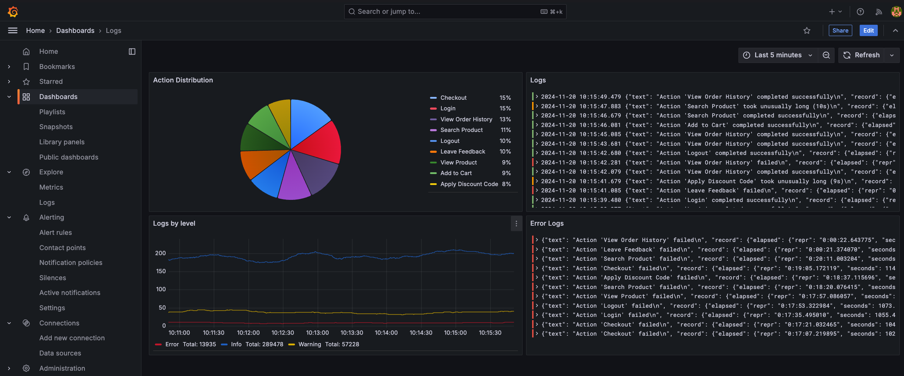
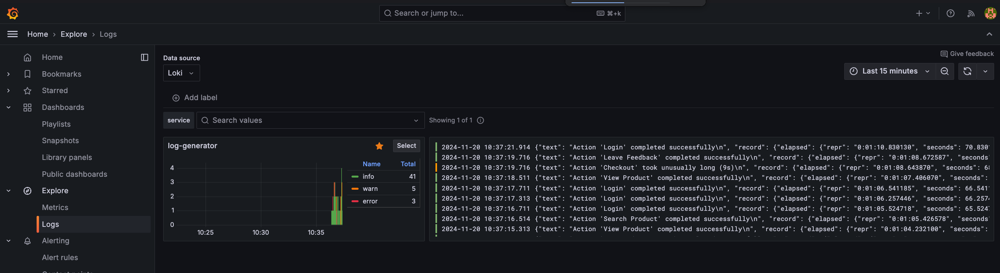

# Loguru Observability Example

This repository demonstrates the integration of observability tools with the Python logging library [Loguru](https://github.com/Delgan/loguru). 
By using tools like OpenTelemetry, Loki, and Grafana, this example showcases how to enhance application monitoring, 
debugging, and insights.

## Features

- **Loguru**: A powerful and easy-to-use Python logging library.
- **OpenTelemetry**: Captures traces and metrics to monitor application performance.
- **Loki**: A log aggregation system for efficient log querying.
- **Grafana**: Visualizes logs and metrics in real-time.

## Why This Project?

Modern applications require robust observability to understand their performance and behavior in complex environments. 
This project bridges Python's intuitive logging via Loguru with advanced observability platforms, 
simplifying monitoring setup and showcasing best practices.

## Requirements

- Docker

## Usage

1. Clone the repository:
   ```bash
   git clone https://github.com/AlTosterino/Loguru-Observability-Example.git
   cd Loguru-Observability-Example
   ```
2. Start the environment using Docker Compose:
   ```bash
   make run
   ``` 
3. Access Grafana to visualize logs and metrics: http://localhost:3000

## Available Dashboard


## Logs
